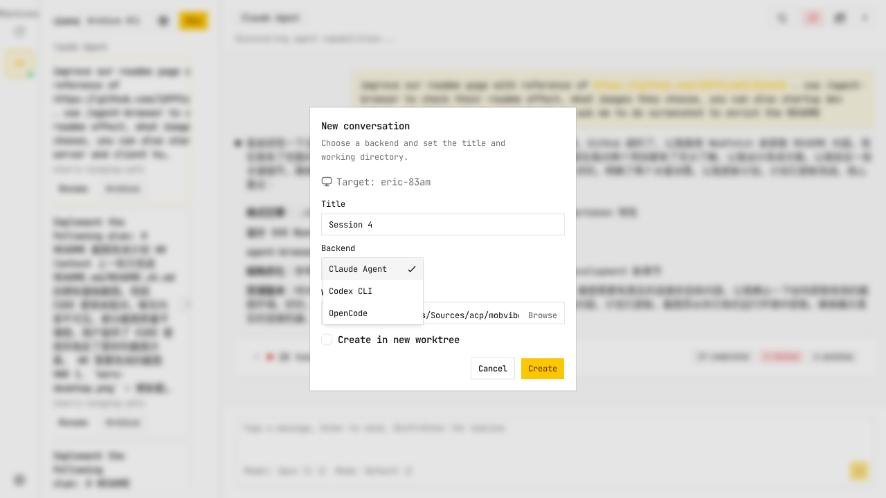
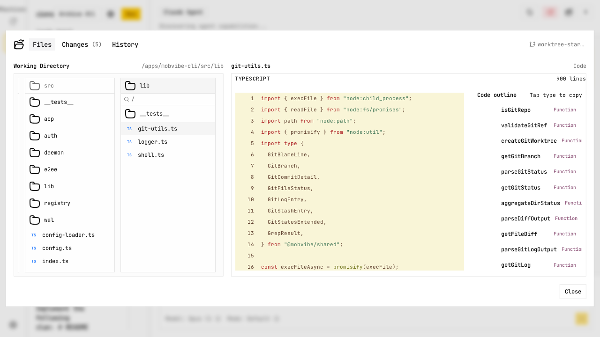
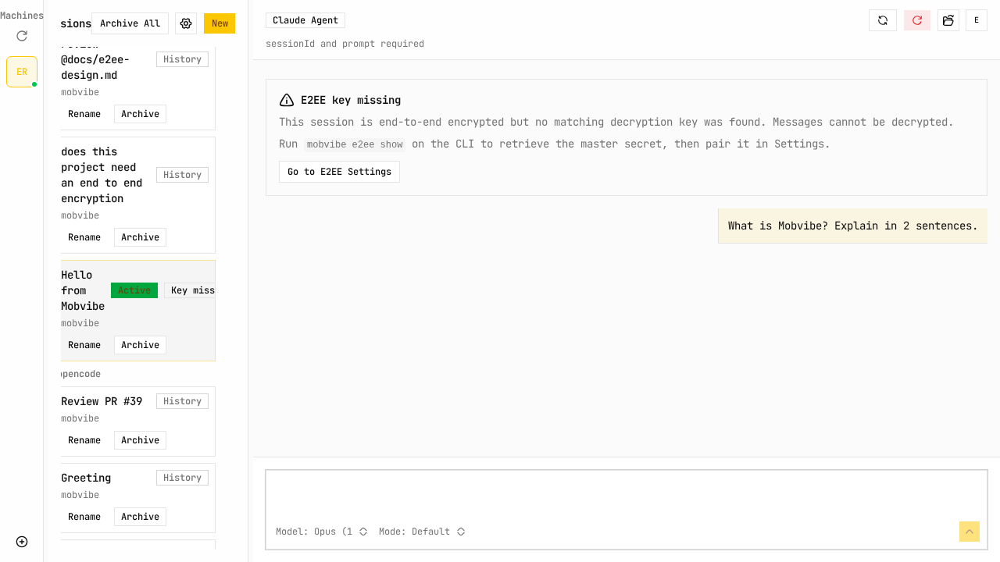
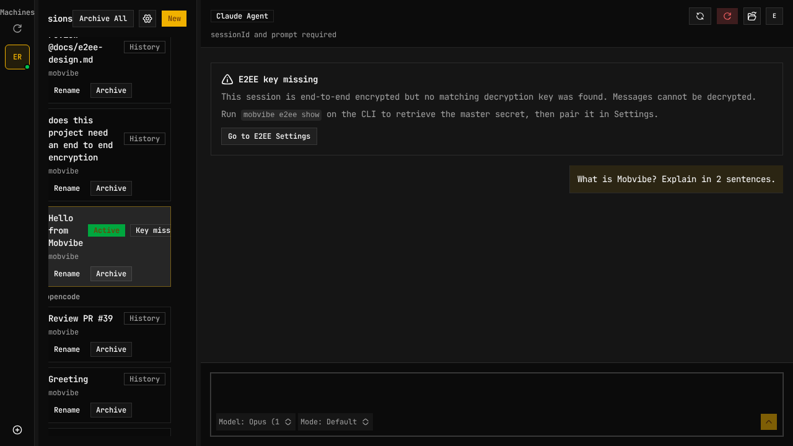

<p align="center">
  
</p>

<p align="center">
  <strong>在任何设备上与本地 AI 编程 Agent 对话。无需设置，一行命令。</strong>
</p>

<p align="center">
  <a href="https://github.com/Eric-Song-Nop/mobvibe/blob/master/LICENSE"></a>
  
</p>

<p align="center">
  中文 | <a href="README.md">English</a>
</p>

<p align="center">
  <a href="#功能特性">功能特性</a> &middot;
  <a href="#支持的-acp-agents">Agents</a> &middot;
  <a href="#快速开始">快速开始</a> &middot;
  <a href="#e2ee-配置">E2EE</a> &middot;
  <a href="#自托管">自托管</a>
</p>

---

Mobvibe 是一个分布式 [ACP](https://agentclientprotocol.com/)（Agent Client Protocol）WebUI，用于本地 Agent 工作流。它连接 ACP 兼容的 CLI（OpenCode、Gemini CLI、Claude Code 以及 [20+ 其他 Agent](#支持的-acp-agents)），管理多会话对话，并在桌面和移动端提供快速、触控友好的体验。

<p align="center">
  
</p>

## 功能特性

### 多 Agent 支持

通过 [ACP Registry](https://agentclientprotocol.com) 自动检测已安装的 ACP Agent。首次运行时，Mobvibe 会扫描系统并让你选择要启用的 Agent。

<p align="center">
  
</p>

### 实时流式传输

实时流式聊天，支持 Markdown 渲染、语法高亮和内联工具结果。


### 端到端加密

会话内容在 CLI 端加密、WebUI 端解密。Gateway 只负责路由，**无法读取你的内容**。

### 文件浏览器与 @提及

会话级文件浏览器，支持代码预览、Tree-sitter 大纲，以及 `@` 提及文件选择器进行上下文注入。

<p align="center">
  
</p>

### 跨平台

通过 Tauri v2 支持 Web、桌面和移动应用。一套代码，原生性能。

### 浅色 / 深色 / 跟随系统主题

自动跟随系统偏好切换主题。支持中英双语。

<p align="center">
  
  
</p>

### 功能对比

> 此表仅用于展示 Mobvibe 的功能特性，无意冒犯其他项目。我是所有这些产品的长期用户，由衷感谢每个项目背后的付出。

|  | Mobvibe | CC Remote Control | Happy Coder | OpenCode WebUI |
|:--|:--:|:--:|:--:|:--:|
| **开源** | ✅ Apache-2.0 | ❌ | ✅ | ✅ |
| **多 Agent（20+ ACP）** | ✅ | ❌ 仅 Claude | ⚠️ Claude + Codex | ❌ 仅 OpenCode |
| **端到端加密** | ✅ | ❌ | ✅ | ❌ |
| **免反代远程访问** | ✅ 托管网关 | ✅ Anthropic 中继 | ✅ 托管中继 | ❌ 需自建 |
| **代码阅读器 + Tree-sitter 大纲** | ✅ | ❌ | ❌ | ❌ |
| **Git 变更预览** | ✅ | ❌ | ❌ | ❌ |
| **远程任意目录创建会话** | ✅ | ❌ | ❌ | ❌ |
| **浏览并重连历史会话** | ✅ | ❌ | ✅ | ❌ |
| **桌面应用** | ✅ Tauri v2 | ❌ | ❌ | ❌ |
| **移动应用** | ✅ Tauri v2 | ✅ | ✅ | ❌ |
| **主题** | ✅ 浅色 / 深色 / 跟随系统 | ❌ | ❌ | ✅ |
| **自托管** | ✅ | ❌ | ✅ | ✅ |

## 支持的 ACP Agents

> 文档索引：<https://agentclientprotocol.com/llms.txt>

<details>
<summary>点击展开完整 Agent 列表</summary>

以下 Agent 可用于 ACP Client：

- [AgentPool](https://phil65.github.io/agentpool/advanced/acp-integration/)
- [Augment Code](https://docs.augmentcode.com/cli/acp)
- [Blackbox AI](https://docs.blackbox.ai/features/blackbox-cli/introduction)
- [Claude Code](https://docs.anthropic.com/en/docs/claude-code/overview)（通过 [Zed 适配器](https://github.com/zed-industries/claude-code-acp)）
- [Codex CLI](https://developers.openai.com/codex/cli)（通过 [Zed 适配器](https://github.com/zed-industries/codex-acp)）
- [Code Assistant](https://github.com/stippi/code-assistant?tab=readme-ov-file#configuration)
- [Docker's cagent](https://github.com/docker/cagent)
- [fast-agent](https://fast-agent.ai/acp)
- [Gemini CLI](https://github.com/google-gemini/gemini-cli)
- [Goose](https://block.github.io/goose/docs/guides/acp-clients)
- [JetBrains Junie（即将推出）](https://www.jetbrains.com/junie/)
- [Kimi CLI](https://github.com/MoonshotAI/kimi-cli)
- [Minion Code](https://github.com/femto/minion-code)
- [Mistral Vibe](https://github.com/mistralai/mistral-vibe)
- [OpenCode](https://github.com/sst/opencode)
- [OpenHands](https://docs.openhands.dev/openhands/usage/run-openhands/acp)
- [Pi](https://github.com/badlogic/pi-mono/tree/main/packages/coding-agent)（通过 [pi-acp 适配器](https://github.com/svkozak/pi-acp)）
- [Qoder CLI](https://docs.qoder.com/cli/acp)
- [Qwen Code](https://github.com/QwenLM/qwen-code)
- [Stakpak](https://github.com/stakpak/agent?tab=readme-ov-file#agent-client-protocol-acp)
- [VT Code](https://github.com/vinhnx/vtcode/blob/main/README.md#zed-ide-integration-agent-client-protocol)

</details>

### 安装常用 Agent

检测优先级：**Binary**（最快）> **npx**（Node.js）> **uvx**（Python）。

| Agent | 安装方式 |
|-------|---------|
| [OpenCode](https://github.com/sst/opencode) | `curl -fsSL https://opencode.ai/install \| bash` |
| [Claude Code](https://docs.anthropic.com/en/docs/claude-code/overview) | `npm install -g @anthropic-ai/claude-code`（需要 `ANTHROPIC_API_KEY`） |
| [Gemini CLI](https://github.com/google-gemini/gemini-cli) | `npm install -g @google/gemini-cli` |
| [Codex CLI](https://developers.openai.com/codex/cli) | `npm install -g @openai/codex`（需要 `OPENAI_API_KEY`） |
| [Goose](https://block.github.io/goose/docs/guides/acp-clients) | 参见[安装指南](https://block.github.io/goose/docs/guides/acp-clients) |
| [Aider](https://aider.chat) | `pip install aider-chat` |

安装新 Agent 后重启 Mobvibe，即可自动检测。

## 快速开始

```bash
npx @mobvibe/cli login
npx @mobvibe/cli start
```

然后在浏览器中打开 [app.mobvibe.net](https://app.mobvibe.net)。首次运行时，Mobvibe 会扫描系统中已安装的 ACP Agent，并让你选择要启用的 Agent。

<details>
<summary>CLI 命令</summary>

| 命令 | 说明 |
|------|------|
| `mobvibe login` | 认证并生成 E2EE 主密钥 |
| `mobvibe logout` | 清除认证凭据 |
| `mobvibe auth-status` | 查看认证状态 |
| `mobvibe start [--gateway <url>]` | 启动守护进程 |
| `mobvibe stop` | 停止守护进程 |
| `mobvibe status` | 查看守护进程状态 |
| `mobvibe logs [-f] [-n <lines>]` | 查看守护进程日志 |
| `mobvibe e2ee show` | 显示主密钥（用于 WebUI 配对） |
| `mobvibe e2ee status` | 查看 E2EE 密钥状态 |

</details>

<details>
<summary>配置</summary>

| 变量 | 说明 |
|------|------|
| `MOBVIBE_GATEWAY_URL` | Gateway URL（默认：`https://api.mobvibe.net`） |
| `MOBVIBE_HOME` | CLI 家目录（默认：`~/.mobvibe`） |
| `MOBVIBE_ENABLED_AGENTS` | 逗号分隔的 Agent ID 列表（覆盖配置文件） |

高级配置存储在 `~/.mobvibe/.config.json`：

| 字段 | 说明 |
|------|------|
| `enabledAgents` | 已启用的 Agent ID 数组（如 `["claude-code"]`） |
| `worktreeBaseDir` | Git worktree 根目录（默认：`~/.mobvibe/worktrees`） |

</details>

## E2EE 配置

<details>
<summary>点击展开 E2EE 配置步骤</summary>

### 1. 登录（CLI）

```bash
mobvibe login
```

输入邮箱和密码。完成后会生成主密钥并注册设备。主密钥会显示在终端 — 复制它用于第 2 步。

### 2. 配对 WebUI

打开 WebUI → 设置 → 端到端加密 → 粘贴主密钥 → 点击「配对」。

之后可用 `mobvibe e2ee show` 再次查看主密钥。

### 3. 启动守护进程

```bash
mobvibe start
```

所有会话内容现已端到端加密。Gateway 只负责路由，无法读取内容。

</details>

## 架构

```
┌──────────────┐         ┌──────────────┐         ┌──────────────────┐
│              │  WS/HTTP │              │  WS/HTTP │                  │
│   WebUI      │◄────────►│   Gateway    │◄────────►│   CLI 守护进程    │
│  (浏览器)     │  (E2EE)  │  (中继服务器)  │  (E2EE)  │  (本地机器)       │
│              │         │              │         │                  │
└──────────────┘         └──────────────┘         └────────┬─────────┘
                                                           │ stdio
                                                  ┌────────▼─────────┐
                                                  │   ACP Agents     │
                                                  │  (claude-code,   │
                                                  │   opencode, ...) │
                                                  └──────────────────┘
```

- **WebUI** — React 19 + Vite 前端（通过 Tauri v2 支持 Web / 桌面 / 移动端）
- **Gateway** — Express + Socket.io 中继服务器；在 WebUI 和 CLI 之间路由加密事件
- **CLI 守护进程** — 基于 Bun 的本地进程，管理 ACP Agent 生命周期
- **ACP Agents** — 任何 ACP 兼容的编程 Agent（Claude Code、OpenCode、Gemini CLI 等）

## 自托管

Mobvibe 支持自托管。基础设施配置定义在仓库根目录的 `render.yaml` 中。详见[源码仓库](https://github.com/Eric-Song-Nop/mobvibe)。

## 开发

### 前置条件

- Node.js >= 22
- [pnpm](https://pnpm.io/) >= 9
- [Bun](https://bun.sh/)（用于 mobvibe-cli）

### 开始

```bash
git clone https://github.com/Eric-Song-Nop/mobvibe.git
cd mobvibe
pnpm install
pnpm dev
```

## 文档

- [ACP 协议](https://agentclientprotocol.com/)
- [ACP TypeScript SDK](https://agentclientprotocol.github.io/typescript-sdk/)

## 许可证

[Apache-2.0](LICENSE)
